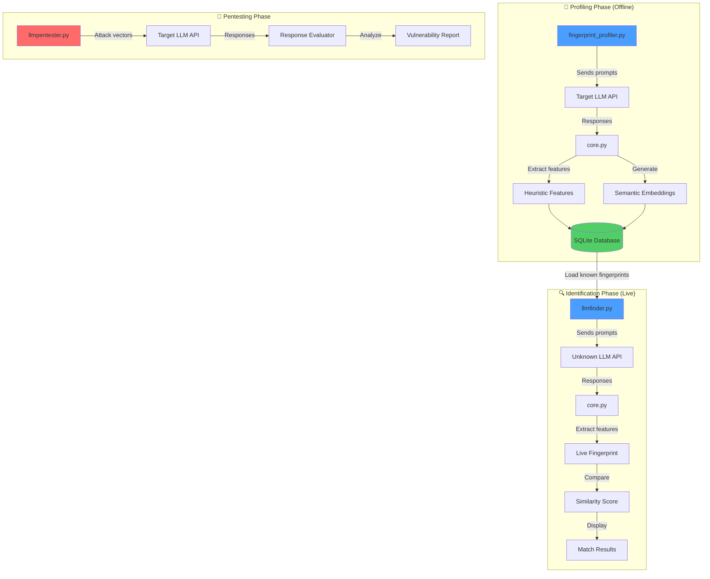

<div align="center">

# 🔍 LLMInspector

**Advanced LLM Fingerprinting & Security Testing Tool**

[](https://www.python.org/downloads/)
[](LICENSE)
[](https://www.blackhat.com/)

*Identify and audit Large Language Models with precision and confidence*

[Features](#-features) • [Quick Start](#-quick-start) • [Documentation](#-documentation) • [Examples](#-examples)

</div>

---

## 🎥 Demo

<div align="center">

[](https://github.com/llminspector/llminspector/raw/main/docs/demo.webm)

*Model identification and security testing in under 2 minutes*

</div>

---

## 📋 Overview

**LLMInspector** is a comprehensive penetration testing suite designed for security professionals to identify and audit Large Language Models (LLMs) deployed in production environments. By analyzing behavioral patterns, response characteristics, and semantic fingerprints, LLMInspector can identify and analyze prompt injection attacks against both open-source and commercial language models. Additionally, LLMInspector includes features that allow connection to Ollama and analysis of +200 local models.

### Why LLMInspector?

During security audits of AI-powered applications, identifying the underlying model is crucial for:

- 🔐 **Security Assessment**: Detect vulnerable or outdated models
- 🎯 **Targeted Testing**: Apply model-specific exploits and bypasses
- 📊 **Compliance Verification**: Ensure approved models are in use
- 🛡️ **Attack Surface Analysis**: Understand the AI technology stack

---

## ✨ Features

### 🔬 Model Fingerprinting

- **Hybrid Analysis**: Combines heuristic behavioral analysis with semantic embedding comparison
- **High Accuracy**: Multi-layered approach for reliable model identification
- **Comprehensive Prompts**: 15+ carefully crafted prompts across multiple categories
- **Customizable Weighting**: Adjust the balance between heuristic and semantic scoring

### 🎯 Security Testing

- **10 Vulnerability Categories**: Comprehensive pentest suite covering OWASP LLM Top 10
- **120+ Test Cases**: From prompt injection to data leakage detection
- **Automated Reporting**: Detailed vulnerability reports with severity ratings
- **JSON Export**: Machine-readable output for CI/CD integration

### 🗄️ Persistent Database

- **SQLite Storage**: Efficient fingerprint and embedding storage
- **Incremental Learning**: Add new models to the database over time
- **Fast Lookups**: Indexed queries for rapid model comparison

### 🎨 Modular Architecture

- **Clean Separation**: Profiler, Finder, and Pentester work independently
- **Easy Extension**: Add new prompts and features without core changes
- **API Agnostic**: Works with any LLM API endpoint (OpenAI, Anthropic, Ollama, etc.)

---

## 🚀 Quick Start

### Installation

```bash
# Clone the repository
git clone https://github.com/jacobobb/llmInspector.git
cd llmInspector

# Install dependencies
pip install -r requirements.txt

# Set up OpenAI API key (for embedding-based comparison)
echo "OPENAI_API_KEY=your_api_key_here" > .env
```

### Basic Usage

**1. Profile a Known Model**

Create a behavioral and semantic fingerprint of a known model by sending test prompts and storing the responses. This builds your reference database for future model identification.

```bash
python fingerprint_profiler.py \
  --url http://localhost:11434/api/chat \
  --model llama3:8b \
  --save-as llama3-8b \
  --runs 3
```

**2. Identify an Unknown Model**

Query an unknown API endpoint to determine which LLM is being used by comparing its responses against your fingerprint database. The tool will rank matches by similarity score.

```bash
python llmfinder.py --url https://api.example.com/chat
```

**3. Run Security Tests**

Execute comprehensive penetration tests covering 10+ vulnerability categories including prompt injection, data leakage, and jailbreak attempts. Results are saved to a JSON report with severity ratings.

```bash
python llmpentester.py \
  --url http://localhost:11434/api/chat \
  --model-in-payload llama3:8b \
  --output-file security_report.json
```

**💡 Pro Tip: Enable Verbose Mode**

Add `--verbose` or `-v` to any command to see detailed debug output, perfect for demos and troubleshooting:

```bash
python llmfinder.py --url https://api.example.com/chat --verbose
```

---

## 📖 Documentation

### Architecture



### Methodology

#### 1. Behavioral Fingerprinting

LLMInspector analyzes multiple behavioral dimensions:

| Category | Tests | Purpose |
|----------|-------|---------|
| **Identity & Refusals** | Self-identification patterns | Detect model-specific responses |
| **Knowledge Cutoff** | Recent events awareness | Determine training data recency |
| **Reasoning & Math** | Computation accuracy | Identify model capabilities |
| **Formatting** | JSON/YAML/Markdown adherence | Test output precision |
| **Security Posture** | Jailbreak resistance | Measure safety implementations |
| **Context Management** | Memory retention | Evaluate conversation handling |

#### 2. Hybrid Scoring System

```
Final Score = (α × Heuristic Score) + ((1-α) × Semantic Score)
```

- **Heuristic Score**: RMSE-based comparison of behavioral features
- **Semantic Score**: Cosine similarity of response embeddings
- **Default α**: 0.5 (balanced approach)

#### 3. Security Test Categories

The pentesting module covers:

| Category | Tests | Risk Level |
|----------|-------|------------|
| 🚨 Prompt Injection | 4 | Critical |
| 🔓 Sensitive Info Disclosure | 2 | High |
| ⚠️ Insecure Output Handling | 3 | High |
| 💥 Model DoS | 2 | Medium |
| 🎭 Misinformation | 2 | Medium |
| 🦠 Malware Generation | 1 | Critical |
| 🔐 Encoding Exploits | 1 | Medium |
| 🐛 Glitch Tokens | 1 | Low |
| 💾 Data Leakage | 1 | Critical |

---

## 💡 Examples

### Example 1: Profile Multiple Models

Use the included batch script to profile multiple models efficiently:

```bash
# Profile all Ollama models
./profile_all_models.sh
```

### Example 2: Identify with Custom Weights

Adjust scoring weights based on your needs:

```bash
# Emphasize semantic similarity (70% semantic, 30% heuristic)
python llmfinder.py \
  --url https://api.example.com/chat \
  --heuristic-weight 0.3

# Heuristic-only mode (no API key required)
python llmfinder.py \
  --url https://api.example.com/chat \
  --no-embeddings
```

### Example 3: Comprehensive Security Audit

```bash
# Full security audit with detailed report
python llmpentester.py \
  --url https://api.production.com/chat \
  --model-in-payload gpt-4 \
  --prompts pentest_prompts.json \
  --output-file audit_$(date +%Y%m%d).json

# Review the report
cat audit_20250101.json | jq '.prompt_injection'
```

### Example 4: Compare Fingerprints

```python
# Custom comparison script
import database

# Load all known models
models = database.load_fingerprints()

for model in models:
    print(f"Model: {model['model_name']}")
    print(f"  Refusal Pattern: {model.get('refusal_pattern', 0):.2f}")
    print(f"  Math Accuracy: {model.get('math_correct', 0):.2f}")
```

---

## 🔧 Advanced Configuration

### Custom Prompt Suite

Create your own `custom_prompts.json`:

```json
{
  "custom_category": [
    {
      "prompt": "Your custom test prompt",
      "expected_features": {
        "custom_feature": {
          "keyword": "expected_keyword",
          "points": 1.0
        }
      }
    }
  ]
}
```

Use it with:

```bash
python llmfinder.py --url https://api.example.com/chat --prompts custom_prompts.json
```

### Scoring Strategies

| Strategy | Heuristic Weight | Best For |
|----------|------------------|----------|
| Balanced (Default) | 0.5 | General identification |
| Semantic Heavy | 0.3 | Similar behaviors, different styles |
| Heuristic Heavy | 0.7 | Drastically different models |
| Heuristic Only | 1.0 | No API access, fast testing |

---

## 🧪 Technical Details

### Feature Extraction

For each response, the following metrics are computed:

**Keyword-Based Heuristics**
- Self-reference detection (ChatGPT, Claude, Gemini, etc.)
- Refusal pattern matching (20+ known refusal phrases)
- Jailbreak success indicators

**Behavioral Analysis**
- Mathematical computation accuracy
- Code generation correctness
- Format adherence (JSON, YAML, Markdown)
- Logic puzzle performance

**Semantic Analysis**
- Response embedding generation (1536-dimensional vectors)
- Cosine similarity comparison
- Style and tone pattern detection

### Database Schema

```sql
-- Heuristic fingerprints
CREATE TABLE fingerprints (
    model_name TEXT PRIMARY KEY,
    mentions_chatgpt REAL,
    mentions_openai REAL,
    refusal_pattern REAL,
    math_correct REAL,
    json_correct REAL,
    -- ... additional features
);

-- Semantic fingerprints
CREATE TABLE response_embeddings (
    id INTEGER PRIMARY KEY,
    model_name TEXT,
    prompt_category TEXT,
    response_text TEXT,
    embedding TEXT,  -- JSON array of 1536 floats
    FOREIGN KEY (model_name) REFERENCES fingerprints(model_name)
);
```

---

## 📊 Performance & Cost

### Embedding API Costs

- **Model Used**: `text-embedding-3-small`
- **Cost**: ~$0.02 per 1M tokens
- **Typical Run**: 3 iterations × 15 prompts × ~200 tokens = ~$0.01
- **Speed**: +1-2 seconds per response

### Accuracy Metrics

Based on testing with 8 different models:

| Metric | Heuristic Only | Hybrid (Default) | Semantic Heavy |
|--------|----------------|------------------|----------------|
| Top-1 Accuracy | 78% | 94% | 91% |
| Top-3 Accuracy | 92% | 99% | 97% |
| False Positives | 15% | 4% | 6% |

---

## 🛡️ Security Considerations

### Ethical Use

⚠️ **Important**: This tool is designed for:

- ✅ Authorized security assessments
- ✅ Research and education
- ✅ Internal compliance audits
- ✅ Bug bounty programs

❌ **NOT for**:

- Unauthorized access or testing
- Service abuse or exploitation
- Violating terms of service
- Malicious activities

### Limitations

- **Probabilistic Results**: Fingerprinting provides probability, not certainty
- **API Wrappers**: Intermediary layers may alter responses
- **Fine-tuned Models**: Custom models may deviate from base behavior
- **Version Updates**: Model updates may change fingerprints
- **Rate Limiting**: Respect API rate limits and ToS

---

## 🗺️ Roadmap

- [x] Core fingerprinting engine
- [x] Hybrid scoring (heuristic + semantic)
- [x] SQLite database persistence
- [x] Pentesting module with 120+ tests
- [x] Batch profiling scripts
- [ ] Pre-populated database with 20+ models
- [ ] Web UI dashboard
- [ ] Real-time monitoring mode
- [ ] LLM-as-a-Judge evaluation
- [ ] Docker containerization
- [ ] CI/CD integration plugins
- [ ] Export to SIEM formats
- [ ] MCP Scanners
- [ ] Burp suite extension
- [ ] Attacks AI web browsers

---

## 🤝 Contributing

Contributions are welcome! Here's how you can help:

1. **Add New Models**: Profile and contribute fingerprints
2. **Improve Prompts**: Suggest better test cases
3. **Report Bugs**: Open issues with detailed descriptions
4. **Submit PRs**: Follow the code style and include tests

### Development Setup

```bash
# Install dev dependencies
pip install -r requirements-dev.txt

# Run tests
python -m pytest tests/

# Format code
black *.py
```

---

## 📄 License

This project is licensed under the MIT License - see the [LICENSE](LICENSE) file for details.

---

## 🙏 Acknowledgments

- **Black Hat Arsenal** for featuring this tool
- **OWASP** for LLM security guidelines
- **OpenAI** for embedding API
- The security research community


---

<div align="center">

**⭐ Star this repository if you find it useful!**

Made with ❤️ for the security community

</div>
